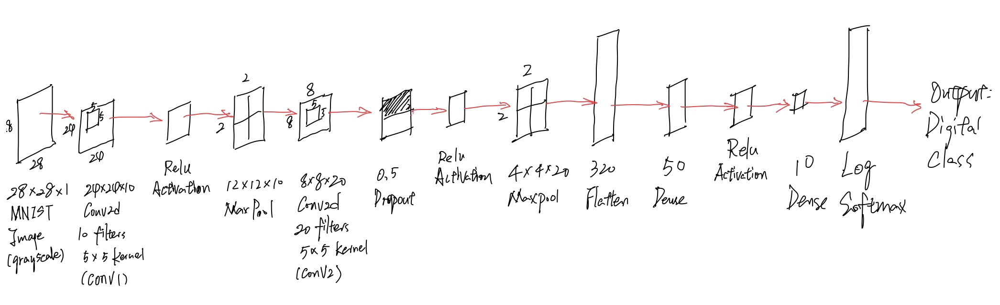

# cs5330_project05_mnist_digit_recognition

CS5330 Pattern Recognition & Computer Vision

NEU 2023 Fall

Instructor: Bruce Maxwell

Team: Shi Zhang, ZhiZhou Gu

## Project Report

### 1. Introduction

### 2. Visual Demonstrations

#### Task 1: Build and train a network to recognize digits

##### A. Get the MNIST digit data set


##### B. Build a network model



The network model has following layers:

1. MNIST Image Input: 28x28x1 (Grayscale image)
2. Conv2d: 10 filters, 5x5 kernel, Output Dimension: 24x24x10
3. ReLU Activation: Dimension: 24x24x10
4. Max Pooling: 2x2, Output Dimension: 12x12x10
5. Conv2d: 20 filters, 5x5 kernel, Output Dimension: 8x8x20
6. Dropout: 0.5, Dimension: 8x8x20
7. ReLU Activation: Dimension: 8x8x20
8. Max Pooling: 2x2, Output Dimension: 4x4x20
9. Flatten: Output Dimension: 320
10. Linear: 320 to 50, Output Dimension: 50
11. ReLU Activation: Dimension: 50
12. Linear: 50 to 10, Output Dimension: 10
13. Log Softmax: Dimension: 10
14. Output: Digit Class, Dimension: 10

##### C. Train the model


##### E. Read the network and run it on the test set


Program Output

```markdown
Image 1
Network Output: ['-17.82', '-17.10', '-10.80', '-10.20', '-23.02', '-18.32', '-32.49', '-0.00', '-14.39', '-14.58']
Predicted Label: 7
Actual Label: 7

Image 2
Network Output: ['-9.57', '-10.34', '-0.00', '-12.99', '-20.10', '-23.00', '-17.06', '-22.13', '-13.62', '-25.67']
Predicted Label: 2
Actual Label: 2

Image 3
Network Output: ['-12.99', '-0.00', '-10.27', '-13.42', '-8.43', '-15.00', '-11.29', '-8.63', '-11.01', '-13.11']
Predicted Label: 1
Actual Label: 1

Image 4
Network Output: ['-0.00', '-23.58', '-15.20', '-18.14', '-19.67', '-15.43', '-11.32', '-18.76', '-15.99', '-12.36']
Predicted Label: 0
Actual Label: 0

Image 5
Network Output: ['-16.93', '-22.50', '-14.76', '-13.97', '-0.00', '-14.35', '-15.48', '-14.89', '-14.16', '-6.97']
Predicted Label: 4
Actual Label: 4

Image 6
Network Output: ['-17.46', '-0.00', '-13.56', '-17.47', '-10.42', '-21.79', '-16.58', '-10.38', '-15.16', '-16.58']
Predicted Label: 1
Actual Label: 1

Image 7
Network Output: ['-26.43', '-19.14', '-14.47', '-17.33', '-0.00', '-15.29', '-22.22', '-12.19', '-8.98', '-8.77']
Predicted Label: 4
Actual Label: 4

Image 8
Network Output: ['-18.50', '-21.07', '-11.31', '-9.05', '-4.20', '-11.52', '-25.45', '-10.08', '-9.50', '-0.02']
Predicted Label: 9
Actual Label: 9

Image 9
Network Output: ['-16.02', '-25.64', '-17.30', '-18.27', '-18.43', '-0.01', '-4.79', '-22.56', '-5.95', '-11.11']
Predicted Label: 5
Actual Label: 5

Image 10
Network Output: ['-19.53', '-26.74', '-18.16', '-13.37', '-9.78', '-14.58', '-29.45', '-7.46', '-10.85', '-0.00']
Predicted Label: 9
Actual Label: 9
```

##### F. Test the network on new inputs

Hand Written Input:


Program Output

```
Network Output for digits/digit_0.png:  ['-0.01', '-5.60', '-6.23', '-10.91', '-6.37', '-11.24', '-8.16', '-9.52', '-5.96', '-7.00']
Predicted Label: 0

Network Output for digits/digit_1.png:  ['-15.95', '-0.01', '-4.77', '-12.12', '-15.65', '-18.72', '-19.05', '-13.29', '-11.55', '-16.82']
Predicted Label: 1

Network Output for digits/digit_2.png:  ['-10.44', '-9.21', '-0.00', '-11.95', '-17.75', '-21.12', '-17.68', '-18.31', '-15.30', '-23.77']
Predicted Label: 2

Network Output for digits/digit_3.png:  ['-14.60', '-2.47', '-9.15', '-5.08', '-1.49', '-7.76', '-17.46', '-0.45', '-12.56', '-3.11']
Predicted Label: 7

Network Output for digits/digit_4.png:  ['-17.68', '-10.21', '-14.65', '-12.29', '-0.02', '-11.93', '-17.85', '-9.09', '-8.79', '-3.79']
Predicted Label: 4

Network Output for digits/digit_5.png:  ['-12.98', '-11.97', '-13.84', '-15.18', '-19.50', '-0.01', '-14.14', '-16.92', '-4.43', '-6.19']
Predicted Label: 5

Network Output for digits/digit_6.png:  ['-13.47', '-15.39', '-15.38', '-14.08', '-11.67', '-3.84', '-0.03', '-25.54', '-4.62', '-19.56']
Predicted Label: 6

Network Output for digits/digit_7.png:  ['-8.11', '-0.63', '-0.97', '-4.29', '-13.45', '-14.77', '-16.49', '-2.63', '-5.55', '-11.34']
Predicted Label: 1

Network Output for digits/digit_8.png:  ['-2.95', '-1.35', '-0.58', '-2.97', '-9.21', '-7.37', '-11.29', '-9.68', '-2.57', '-7.59']
Predicted Label: 2

Network Output for digits/digit_9.png:  ['-6.18', '-0.93', '-1.62', '-7.18', '-4.96', '-5.77', '-6.77', '-1.67', '-1.59', '-9.02']
Predicted Label: 1
```

For the hand written input, only 0, 1, 2, 4, 5, 6 were recognized and matched correctly.
But 3, 7, 8, 9 were identified wrong given the output.

#### Task 2: Examine the network

##### A. Analyze the first layer

##### B. Show the effect of the filters

#### Task 3: Transfer Learning on Greek Letters

#### Task 4: Experimentation with the deep network for the MNIST task

### 3. Extensions

### 4. Reflection

### 5. Acknowledgements

## Project Running Instructions
