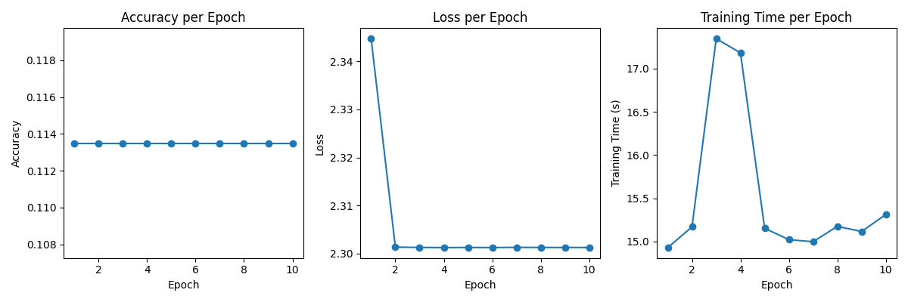

# cs5330_project05_mnist_digit_recognition

CS5330 Pattern Recognition & Computer Vision

NEU 2023 Fall

Instructor: Bruce Maxwell

Team: Shi Zhang, ZhiZhou Gu

## Project Report

### 1. Introduction

In this collaborative project by Shi Zhang and Zhizhou Gu, we aim to explore deep learning through the construction, training, and analysis of a deep neural network focused on digit recognition tasks. Leveraging the widely-used MNIST dataset, we have designed a neural network model featuring layers such as convolution, max pooling, dropout, and linear layers.

This project not only involves building and training the network but also extends to practical applications, testing its efficacy on both standard test images and handwritten digits. Additionally, we delve into network analysis, examining the effects of individual layers, and embark on an experiment with transfer learning using Greek letters.

Our journey culminates in a series of experiments altering various network parameters on the MNIST Fashion dataset, aiming to optimize the network's performance and training efficiency. Through this endeavor, we seek to gain a deeper understanding of neural networks and their capabilities in the realm of image recognition.

### 2. Visual Demonstrations

#### Task 1: Build and train a network to recognize digits

##### A. Get the MNIST digit data set


##### B. Build a network model


The network model has following layers:

1. MNIST Image Input: 28x28x1 (Grayscale image)
2. Conv2d: 10 filters, 5x5 kernel, Output Dimension: 24x24x10
3. ReLU Activation: Dimension: 24x24x10
4. Max Pooling: 2x2, Output Dimension: 12x12x10
5. Conv2d: 20 filters, 5x5 kernel, Output Dimension: 8x8x20
6. Dropout: 0.5, Dimension: 8x8x20
7. ReLU Activation: Dimension: 8x8x20
8. Max Pooling: 2x2, Output Dimension: 4x4x20
9. Flatten: Output Dimension: 320
10. Linear: 320 to 50, Output Dimension: 50
11. ReLU Activation: Dimension: 50
12. Linear: 50 to 10, Output Dimension: 10
13. Log Softmax: Dimension: 10
14. Output: Digit Class, Dimension: 10

##### C. Train the model


##### E. Read the network and run it on the test set


Program Output

```
Image 1
Network Output: ['-17.82', '-17.10', '-10.80', '-10.20', '-23.02', '-18.32', '-32.49', '-0.00', '-14.39', '-14.58']
Predicted Label: 7
Actual Label: 7

Image 2
Network Output: ['-9.57', '-10.34', '-0.00', '-12.99', '-20.10', '-23.00', '-17.06', '-22.13', '-13.62', '-25.67']
Predicted Label: 2
Actual Label: 2

Image 3
Network Output: ['-12.99', '-0.00', '-10.27', '-13.42', '-8.43', '-15.00', '-11.29', '-8.63', '-11.01', '-13.11']
Predicted Label: 1
Actual Label: 1

Image 4
Network Output: ['-0.00', '-23.58', '-15.20', '-18.14', '-19.67', '-15.43', '-11.32', '-18.76', '-15.99', '-12.36']
Predicted Label: 0
Actual Label: 0

Image 5
Network Output: ['-16.93', '-22.50', '-14.76', '-13.97', '-0.00', '-14.35', '-15.48', '-14.89', '-14.16', '-6.97']
Predicted Label: 4
Actual Label: 4

Image 6
Network Output: ['-17.46', '-0.00', '-13.56', '-17.47', '-10.42', '-21.79', '-16.58', '-10.38', '-15.16', '-16.58']
Predicted Label: 1
Actual Label: 1

Image 7
Network Output: ['-26.43', '-19.14', '-14.47', '-17.33', '-0.00', '-15.29', '-22.22', '-12.19', '-8.98', '-8.77']
Predicted Label: 4
Actual Label: 4

Image 8
Network Output: ['-18.50', '-21.07', '-11.31', '-9.05', '-4.20', '-11.52', '-25.45', '-10.08', '-9.50', '-0.02']
Predicted Label: 9
Actual Label: 9

Image 9
Network Output: ['-16.02', '-25.64', '-17.30', '-18.27', '-18.43', '-0.01', '-4.79', '-22.56', '-5.95', '-11.11']
Predicted Label: 5
Actual Label: 5

Image 10
Network Output: ['-19.53', '-26.74', '-18.16', '-13.37', '-9.78', '-14.58', '-29.45', '-7.46', '-10.85', '-0.00']
Predicted Label: 9
Actual Label: 9
```

##### F. Test the network on new inputs

Hand Written Input:


Program Output

```
Network Output for digits/digit_0.png:  ['-0.01', '-5.60', '-6.23', '-10.91', '-6.37', '-11.24', '-8.16', '-9.52', '-5.96', '-7.00']
Predicted Label: 0

Network Output for digits/digit_1.png:  ['-15.95', '-0.01', '-4.77', '-12.12', '-15.65', '-18.72', '-19.05', '-13.29', '-11.55', '-16.82']
Predicted Label: 1

Network Output for digits/digit_2.png:  ['-10.44', '-9.21', '-0.00', '-11.95', '-17.75', '-21.12', '-17.68', '-18.31', '-15.30', '-23.77']
Predicted Label: 2

Network Output for digits/digit_3.png:  ['-14.60', '-2.47', '-9.15', '-5.08', '-1.49', '-7.76', '-17.46', '-0.45', '-12.56', '-3.11']
Predicted Label: 7

Network Output for digits/digit_4.png:  ['-17.68', '-10.21', '-14.65', '-12.29', '-0.02', '-11.93', '-17.85', '-9.09', '-8.79', '-3.79']
Predicted Label: 4

Network Output for digits/digit_5.png:  ['-12.98', '-11.97', '-13.84', '-15.18', '-19.50', '-0.01', '-14.14', '-16.92', '-4.43', '-6.19']
Predicted Label: 5

Network Output for digits/digit_6.png:  ['-13.47', '-15.39', '-15.38', '-14.08', '-11.67', '-3.84', '-0.03', '-25.54', '-4.62', '-19.56']
Predicted Label: 6

Network Output for digits/digit_7.png:  ['-8.11', '-0.63', '-0.97', '-4.29', '-13.45', '-14.77', '-16.49', '-2.63', '-5.55', '-11.34']
Predicted Label: 1

Network Output for digits/digit_8.png:  ['-2.95', '-1.35', '-0.58', '-2.97', '-9.21', '-7.37', '-11.29', '-9.68', '-2.57', '-7.59']
Predicted Label: 2

Network Output for digits/digit_9.png:  ['-6.18', '-0.93', '-1.62', '-7.18', '-4.96', '-5.77', '-6.77', '-1.67', '-1.59', '-9.02']
Predicted Label: 1
```

For the hand written input, only 0, 1, 2, 4, 5, 6 were recognized and matched correctly.
But 3, 7, 8, 9 were identified wrong given the output.

#### Task 2: Examine the network

##### A. Analyze the first layer

The examination of the network begins with the first convolutional layer, conv1, which consists of ten 5x5 filters.


##### B. Show the effect of the filters

Each filtered image highlights specific features or patterns from the original image, dictated by the corresponding filter's unique structure.


For example, some filters may highlight edges or textures, which are essential features for the network to recognize different objects within the images. The use of OpenCV's filter2D function allows for a direct application of these filters to the input image, demonstrating the initial transformation that input data undergoes as it passes through the network's first layer.

#### Task 3: Transfer Learning on Greek Letters
In this experiment phase, we replace the last full connection layer and fine tune the model by using greek training set. 


Fine-tuned model is saved in './saved_models/finetuned_model.pth'.

## printout    

MyNetwork(
  (conv1): Conv2d(1, 10, kernel_size=(5, 5), stride=(1, 1))   
  (conv2): Conv2d(10, 20, kernel_size=(5, 5), stride=(1, 1))   
  (conv2_drop): Dropout2d(p=0.5, inplace=False)   
  (fc1): Linear(in_features=320, out_features=50, bias=True)   
  (fc2): Linear(in_features=50, out_features=3, bias=True)   
)

1. MNIST Image Input: 28x28x1 (Grayscale image)
2. Conv2d: 10 filters, 5x5 kernel, Output Dimension: 24x24x10
3. ReLU Activation: Dimension: 24x24x10
4. Max Pooling: 2x2, Output Dimension: 12x12x10
5. Conv2d: 20 filters, 5x5 kernel, Output Dimension: 8x8x20
6. Dropout: 0.5, Dimension: 8x8x20
7. ReLU Activation: Dimension: 8x8x20
8. Max Pooling: 2x2, Output Dimension: 4x4x20
9. Flatten: Output Dimension: 320
10. Linear: 320 to 50, Output Dimension: 50
11. ReLU Activation: Dimension: 50
12. Linear: 50 to 3, Output Dimension: 3
13. Log Softmax: Dimension: 3
14. Output: Greek Class Label, Dimension: 3

#### Task 4: Experimentation with the deep network for the MNIST task

##### A. Develop a plan

In this experimentation phase, the primary objective is to explore the impact of varying different aspects of the deep network architecture on the MNIST Fashion dataset. The MNIST Fashion dataset, being more complex than the standard MNIST digits dataset, serves as an ideal candidate to observe the effects of these architectural changes. The following dimensions have been chosen for this experiment:

- The Number of Filters in Convolution Layers: The options explored are 5, 10, 20, and 30 filters.
- The Number of Hidden Nodes in the Dense Layer: The numbers tested are 32, 64, 128, and 256 nodes.
- The Dropout Rate: Different dropout rates tested are 0.3, 0.5, 0.7, and 0.9.

The experimental approach is structured around a linear search strategy. In this method, two of the parameters will be held constant while varying the third. This process will be repeated in a round-robin fashion, changing the variable parameter each time. The plan is to automate this process to efficiently evaluate 64 (4 x 4 x 4) network variations.

Metrics for evaluation will include accuracy, training time, and average loss. These metrics will provide a comprehensive understanding of each network variation's performance and efficiency.

##### B. Predict the results

Number of Filters in Convolution Layers: More filters might improve the network's ability to recognize complex patterns, potentially increasing accuracy but also training time.

Number of Nodes in the Dense Layer: As before, a higher number of nodes might improve accuracy but potentially increase training time and risk of overfitting.

Dropout Rate: Higher dropout rates may improve generalization at the risk of losing relevant features, potentially affecting accuracy.

These hypotheses will be tested against the actual results obtained from the experiment to determine their validity.

##### C. Actual Results

For Accuracy:


For Training Time:


For Average Loss:


###### Number of Filters in Convolution Layers:

| Number of Filters | Average Accuracy | Average Loss | Average Training Time (s) |
| ----------------- | ---------------- | ------------ | ------------------------- |
| 5                 | 87.13%           | 0.47         | 93.82                     |
| 10                | 88.50%           | 0.43         | 106.24                    |
| 20                | 89.10%           | 0.41         | 133.33                    |
| 30                | 89.32%           | 0.39         | 158.33                    |

- Accuracy modestly increases with more filters, peaking at 89.32% for 30 filters, indicating improved feature capture. However, the marginal gains diminish as the filter count increases.
- The training time rises with filter count, suggesting a trade-off between accuracy and computational cost.
- Loss decreases as filters increase but stabilizes, highlighting a potential optimal filter range for efficiency.

###### Number of Nodes in the Dense Layer:

| Number of Nodes | Average Accuracy | Average Loss | Average Training Time (s) |
| --------------- | ---------------- | ------------ | ------------------------- |
| 32              | 88.55%           | 0.46         | 101.78                    |
| 64              | 88.81%           | 0.40         | 130.99                    |
| 128             | 88.90%           | 0.39         | 162.94                    |
| 256             | 88.95%           | 0.39         | 177.95                    |

- Accuracy benefits from more nodes, reaching a high of 88.95% for 256 nodes, but shows diminishing returns for larger dense layers.
- Training time grows significantly with more nodes, underscoring the increased computational burden.
- Loss decreases with more nodes but plateaus, suggesting a balanced network capacity is crucial to avoid overfitting.

###### Dropout Rate:

| Dropout Rate | Average Accuracy | Average Loss | Average Training Time (s) |
| ------------ | ---------------- | ------------ | ------------------------- |
| 0.3          | 88.95%           | 0.38         | 163.13                    |
| 0.5          | 88.92%           | 0.40         | 154.77                    |
| 0.7          | 88.84%           | 0.43         | 155.60                    |
| 0.9          | 85.32%           | 0.86         | 103.57                    |

- Accuracy varies with dropout rates, peaking at 88.95% for a 0.3 rate, and suggests an optimal rate exists for this dataset.
- Training time is not heavily influenced by dropout rates, aligning with expectations that dropout mainly affects model generalization.
- Loss is inconsistent across dropout rates, with a notable increase at higher rates, indicating a careful balance is needed to maintain model performance.

In summary, the experiment confirms that while increasing the number of filters and dense layer nodes can enhance model accuracy, there is a balance to be struck to prevent excessive training times and overfitting. The impact of dropout rates on accuracy and loss underscores the importance of tuning this parameter to the specific characteristics of the dataset and model architecture. These insights should guide future architecture decisions and hyperparameter tuning efforts.

### 3. Extensions

#### Replace the first layer of the MNIST network with a filter bank of Gabor filters

Results:



| epoch | accuracy | training_time | loss     |
| ----- | -------- | ------------- | -------- |
| 1     | 0.1135   | 14.93         | 2.344721 |
| 2     | 0.1135   | 15.17         | 2.301348 |
| 3     | 0.1135   | 17.35         | 2.301278 |
| 4     | 0.1135   | 17.18         | 2.301252 |
| 5     | 0.1135   | 15.15         | 2.301274 |
| 6     | 0.1135   | 15.02         | 2.301259 |
| 7     | 0.1135   | 14.99         | 2.301298 |
| 8     | 0.1135   | 15.18         | 2.301268 |
| 9     | 0.1135   | 15.12         | 2.301270 |
| 10    | 0.1135   | 15.31         | 2.301266 |

- Accuracy per Epoch: The accuracy remains relatively constant throughout the epochs, which could suggest that the network is not learning effectively from the Gabor filters or the rest of the architecture is not suitable to improve upon the features extracted by the Gabor filters.

- Loss per Epoch: The loss drops significantly after the first epoch and then stabilizes. This indicates that the network quickly reaches a point where it does not improve further, which might be a sign that the network is stuck in a local minimum or that the initial learning rate is too high and causes overshooting.

- Training Time per Epoch: The training time per epoch fluctuates, which is unusual since the computational effort per epoch typically remains constant. This could be due to varying system loads if running on a shared system or other processes on the machine that interfere with the consistent measurement of time.

### 4. Reflection

Shi Zhang: My work covers Task 1, Task 4, and Extension. This is my first time learned and trained a deep network. This assignment provides me with hands-on experience coding the fundamental structure of deep networks. I think the challenges came from Task 4 exploring a number of experiment models (in my case 64 of them), training a batch took roughly 2-3 hours, but the best accuracy from the results barely reaches 89%, which may indicate some potential issues in the framework of the "flexible" model.

Zhizhou Gu:  My work covers Task 2, Task 3. In the task2 I learned how to visulize weights of filters and effect of each filter apply to the image. Task3 I learned how to fine tune a model. Those tasks give me some hands-on experience of training and evaluating deep learning model by pytorch.

### 5. Acknowledgements

For the online tutorial we referred to:

- [Tutorial 1: MNIST, the Hello World of Deep Learning](https://medium.com/fenwicks/tutorial-1-mnist-the-hello-world-of-deep-learning-abd252c47709#:~:text=,digit%20is%20written%20there)

- [How to Develop a CNN for MNIST Handwritten Digit Classification](https://machinelearningmastery.com/how-to-develop-a-convolutional-neural-network-from-scratch-for-mnist-handwritten-digit-classification/)

- [Deep learning on MNIST - GitHub](https://github.com/numpy/numpy-tutorials/blob/main/content/tutorial-deep-learning-on-mnist.md)

- [Handwritten Digit Recognition with LeNet5 Model in PyTorch](https://machinelearningmastery.com/handwritten-digit-recognition-with-lenet5-model-in-pytorch/)

## Project Running Instructions

### Project Setup

Our team used Visual Studio Code for this project.

Before running this project, you will need to install several libraries.

The project relies on various Python libraries, including torch, torchvision, matplotlib, numpy, and PIL. To install these libraries, you should open a command prompt or terminal and run the following commands:

```markdown
pip install opencv-python
pip install torch torchvision
pip install matplotlib
pip install numpy
pip install pillow
```

### Project Running by Tasks

#### Task 1

The related files for Task 1 are:

- network.py
- train.py
- evaluate_model.py
- main.py

Please run main.py to see the results.

#### Task 2

The related file for Task 2 is:

- examine_network.py

Please run examine_network.py to see the results.

#### Task 3

The related file for Task 3 is:

- embedding.py

Please run embedding.py to see the results.

#### Task 4

The related files for Task 4 are:

- experiment_network.py
- experiment_train.py
- experiment_main.py

Please run experiment_main.py to see the results.

#### Extension

The related file for extension is:

- gabor_network_train.py

Please run gabor_network_train.py to see the results.

### Travel days usage

We did not use any of the travel days for this assignment.
